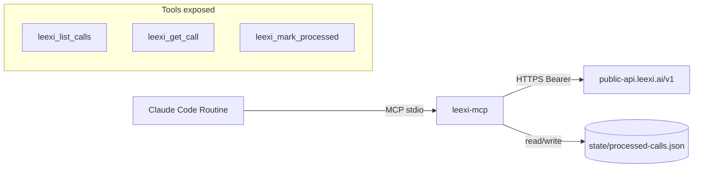

# @donkeycode/leexi-mcp

[](https://github.com/donkeycode/leexi-mcp/actions/workflows/ci.yml)
[](./LICENSE)
[](https://nodejs.org/)

DonkeyCode MCP server for [Leexi](https://www.leexi.ai/) — exposes Leexi calls, transcripts, and per-call processing state to any MCP-compatible client (Claude Code, Claude Desktop, IDE plugins).

## Install as a Claude Code plugin (recommended)

The repo itself is a Claude Code marketplace. Add it once, then install the plugin:

```bash
claude plugins marketplace add donkeycode/leexi-mcp
claude plugins install leexi-mcp@leexi-mcp
```

On first install, you'll be prompted for `LEEXI_API_KEY`. Get one at **Leexi → Settings → Company Settings → API Keys** (requires admin).

> The `@leexi-mcp` suffix disambiguates the plugin from the marketplace; both share the same name in this single-plugin repo.

To update later:

```bash
claude plugins marketplace update leexi-mcp
claude plugins update leexi-mcp@leexi-mcp
```

The plugin auto-registers three tools (`leexi_list_calls`, `leexi_get_call`, `leexi_mark_processed`), a `leexi-routine` skill that teaches Claude how to combine them, and three slash commands:

- `/leexi-today` — list today's calls.
- `/leexi-recent [n]` — list the N most recent calls.
- `/leexi-call <uuid>` — fetch a specific call with transcript.

## Why this MCP?

[Leexi](https://www.leexi.ai/) records and transcribes your calls and meetings. This MCP server lets Claude (in Claude Code, Claude Desktop, or any MCP-compatible client) read those calls and their transcripts, then act on them — write follow-up emails, build CRM records, extract action items, generate summaries.

Designed to be the data backbone of post-call automation routines: a Claude Code Routine polls Leexi every 30 minutes, fetches new transcripts via this MCP, and triggers DonkeyCode skills (mails, devis-agile, mise-en-relation) on each call.

## Tools

| Tool | Description |
|------|-------------|
| `leexi_list_calls` | List recent Leexi calls. Optional filters: `since`, `limit`, `page`, `only_unprocessed`. |
| `leexi_get_call` | Fetch a single call by UUID with full transcript (or summary-only via `include_transcript=false`). |
| `leexi_mark_processed` | Mark a call as processed in the local MCP state, so future `only_unprocessed` queries skip it. |

## Install from source (developers)

```bash
git clone https://github.com/donkeycode/leexi-mcp.git
cd leexi-mcp
pnpm install
pnpm build
```

## Configure

1. Get an API key at **Leexi → Settings → Company Settings → API Keys** (requires admin).
2. Copy `.env.example` to `.env` and fill in:

```
LEEXI_API_KEY=sk-...
LEEXI_API_BASE_URL=https://public-api.leexi.ai/v1
LEEXI_STATE_FILE=./state/processed-calls.json
LEEXI_RATE_LIMIT_PER_MINUTE=50
```

## Register with Claude Code

```bash
claude mcp add leexi-donkeycode \
  --command "node /absolute/path/to/leexi-mcp/dist/index.js" \
  --env LEEXI_API_KEY=sk-... \
  --env LEEXI_STATE_FILE=/absolute/path/to/state/processed-calls.json
```

## Usage from Claude Code

Once registered, any prompt can use the tools. Examples:

> *"Lists today's Leexi calls that I haven't processed yet."*

Claude will call `leexi_list_calls` with `only_unprocessed: true` and a `since` filter for today, then summarize.

> *"Get the full transcript of call abc-123 and draft a follow-up email."*

Claude will call `leexi_get_call` with `uuid: "abc-123"` and use the transcription text to draft.

> *"Mark calls abc-123 and def-456 as processed."*

Claude will call `leexi_mark_processed` twice.

## Local smoke test

```bash
pnpm inspect
```

Prints a sample list, one call detail, and a processed-flag toggle.

## Troubleshooting

**`Invalid configuration: apiKey: LEEXI_API_KEY must be set`**
The MCP cannot read `LEEXI_API_KEY` from the environment. Make sure:
- `.env` exists and contains a valid key (or the var is set in the shell launching Claude Code).
- If using `claude mcp add`, you passed `--env LEEXI_API_KEY=...`.

**`Leexi API 401`**
Your API key is rejected. Regenerate it at **Leexi → Settings → Company Settings → API Keys**.

**`Leexi API 429` repeated**
You're hitting the 50 requests/minute rate limit. The client auto-retries once with `Retry-After`, but a tight polling loop can exhaust this. Increase your polling interval or batch fewer calls per cycle.

**No `dist/index.js`**
Run `pnpm install && pnpm build`. The CI build is committed for plugin distribution, but local dev clones need a build.

**MCP not visible in Claude Code**
Run `claude mcp list` and check the entry exists. If it does but tools don't show, restart Claude Code.

## Develop

```bash
pnpm dev         # tsx watch mode
pnpm test        # vitest run
pnpm lint        # biome check
```

## Architecture



The local JSON store (`LEEXI_STATE_FILE`) deduplicates polling cycles. The store is the MCP's only persistent state; everything else is fetched on demand.

## License

MIT — see [LICENSE](./LICENSE).
