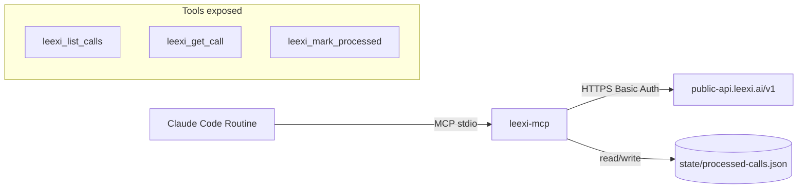

# @donkeycode/leexi-mcp

[](https://github.com/donkeycode/leexi-mcp/actions/workflows/ci.yml)
[](./LICENSE)
[](https://nodejs.org/)

DonkeyCode MCP server for [Leexi](https://www.leexi.ai/) — exposes Leexi calls, transcripts, and per-call processing state to any MCP-compatible client (Claude Code, Claude Desktop, IDE plugins).

## Install as a Claude Code plugin (recommended)

The repo itself is a Claude Code marketplace. Add it once, then install the plugin:

```bash
claude plugins marketplace add donkeycode/leexi-mcp
claude plugins install leexi-mcp@leexi-mcp
```

On first install, you'll be prompted for `LEEXI_API_KEY_ID` and `LEEXI_API_KEY`. Get both at **Leexi → Settings → Company Settings → API Keys** (requires admin).

> The `@leexi-mcp` suffix disambiguates the plugin from the marketplace; both share the same name in this single-plugin repo.

To update later:

```bash
claude plugins marketplace update leexi-mcp
claude plugins update leexi-mcp@leexi-mcp
```

The plugin auto-registers three tools (`leexi_list_calls`, `leexi_get_call`, `leexi_mark_processed`), a `leexi-routine` skill that teaches Claude how to combine them, and three slash commands:

- `/leexi-today` — list today's calls.
- `/leexi-recent [n]` — list the N most recent calls.
- `/leexi-call <uuid>` — fetch a specific call with transcript.

## Why this MCP?

[Leexi](https://www.leexi.ai/) records and transcribes your calls and meetings. This MCP server lets Claude (in Claude Code, Claude Desktop, or any MCP-compatible client) read those calls and their transcripts, then act on them — write follow-up emails, build CRM records, extract action items, generate summaries.

Designed to be the data backbone of post-call automation routines: a Claude Code Routine polls Leexi every 30 minutes, fetches new transcripts via this MCP, and triggers DonkeyCode skills (mails, devis-agile, mise-en-relation) on each call.

## Tools

| Tool | Description |
|------|-------------|
| `leexi_list_calls` | List recent Leexi calls. Returns call metadata: `title`, `performed_at`, `duration` (float seconds), `locale`, `summary` (markdown), `chapters`, `tasks` (Leexi-extracted action items), `speakers`, and more. Pagination: `{ page, items, count }`. Optional filters: `since`, `limit`, `page`, `only_unprocessed`. |
| `leexi_get_call` | Fetch a single call by UUID. Full payload includes `summary` (markdown), `simple_transcript` (plain text string with inline `(HH:MM:SS - HH:MM:SS)` timestamps — read directly), word-level `transcript` array, `chapters`, `tasks`, `call_topics`, `speakers`, `participating_users`, and `meeting_event`. Set `include_transcript=false` for a lite metadata-only payload (zeroes `simple_transcript`, `transcript`, `chapters`, `call_topics`). |
| `leexi_mark_processed` | Mark a call as processed in the local MCP state, so future `only_unprocessed` queries skip it. |

### Real response shapes

**`leexi_list_calls` — one item:**

```json
{
  "uuid": "call-abc-123",
  "locale": "fr-FR",
  "duration": 3645.837,
  "title": "ClientA - Daily Demo",
  "performedAt": "2026-05-22T08:30:00.000Z",
  "summary": "# Daily Demo\n\n## Points abordes\n- API integration...",
  "chapters": [{ "index": 0, "title": "Introduction et Point API", "startTime": 0 }],
  "tasks": [{ "subject": "Finaliser l'integration API", "status": "not_started", "done": false }],
  "speakers": [{ "name": "Alice Example", "isUser": true, "duration": 1023.771 }],
  "pagination": { "page": 1, "items": 2, "count": 864 }
}
```

**`leexi_get_call` — selected fields:**

```json
{
  "uuid": "call-abc-123",
  "locale": "fr-FR",
  "duration": 3645.837,
  "summary": "# Daily Demo\n\n## Actions\n- Finaliser l'integration API\n...",
  "simpleTranscript": "Alice Example (00:00:00 - 00:01:12)\nBonjour a tous...\n\nExternal Speaker (00:01:15 - 00:02:30)\nOui, on a avance...",
  "chapters": [{ "index": 0, "title": "Introduction", "startTime": 0, "text": "..." }],
  "tasks": [{ "subject": "Finaliser l'integration API", "done": false }],
  "callTopics": [{ "keyphrase": "integration API", "topicName": "Interest", "startTime": 223.21 }],
  "participatingUsers": [{ "name": "Alice Example", "email": "alice@example.com" }]
}
```

## Install from source (developers)

```bash
git clone https://github.com/donkeycode/leexi-mcp.git
cd leexi-mcp
pnpm install
pnpm build
```

## Configure

1. Get a key pair at **Leexi → Settings → Company Settings → API Keys** (requires admin).
2. Copy `.env.example` to `.env` and fill in:

```
LEEXI_API_KEY_ID=key_xxxxxxxxx        # the "API Key ID" shown in Leexi settings
LEEXI_API_KEY=secret_xxxxxxxxxxxxxxx  # the "API Key Secret" shown ONCE at creation
LEEXI_API_BASE_URL=https://public-api.leexi.ai/v1
LEEXI_STATE_FILE=./state/processed-calls.json
LEEXI_RATE_LIMIT_PER_MINUTE=50
```

Leexi authentication is HTTP Basic Auth: the MCP sends `Authorization: Basic base64(LEEXI_API_KEY_ID:LEEXI_API_KEY)` on every request. Both values come from the same key creation screen in Leexi — the **ID** is the public identifier, the **Key** is the secret shown only once at creation. If you've lost the secret, regenerate the pair.

## Register with Claude Code

```bash
claude mcp add leexi-donkeycode \
  --command "node /absolute/path/to/leexi-mcp/dist/index.js" \
  --env LEEXI_API_KEY_ID=key_... \
  --env LEEXI_API_KEY=secret_... \
  --env LEEXI_STATE_FILE=/absolute/path/to/state/processed-calls.json
```

## Usage from Claude Code

Once registered, any prompt can use the tools. Examples:

> *"Lists today's Leexi calls that I haven't processed yet."*

Claude will call `leexi_list_calls` with `only_unprocessed: true` and a `since` filter for today, then summarize.

> *"Get the full transcript of call abc-123 and draft a follow-up email."*

Claude will call `leexi_get_call` with `uuid: "abc-123"` and use the transcription text to draft.

> *"Mark calls abc-123 and def-456 as processed."*

Claude will call `leexi_mark_processed` twice.

## Local smoke test

```bash
pnpm inspect
```

Prints a sample list, one call detail, and a processed-flag toggle.

## Troubleshooting

**`Invalid configuration: apiKeyId: LEEXI_API_KEY_ID must be set` or `apiKey: LEEXI_API_KEY must be set`**
The MCP needs BOTH halves of the Leexi key pair:
- `LEEXI_API_KEY_ID` — the public identifier shown at the top of each API Key row.
- `LEEXI_API_KEY` — the secret displayed once at creation.

Make sure both are set in `.env` or passed via `--env` when registering with `claude mcp add`. If you have the ID but lost the secret, regenerate the pair in Leexi.

**`Leexi API 401`**
Your credentials are rejected. Regenerate the key pair at **Leexi → Settings → Company Settings → API Keys**. Most often: the ID and Secret don't match (cross-paste), or the Secret was regenerated and your local copy is stale.

**`Leexi API 429` repeated**
You're hitting the 50 requests/minute rate limit. The client auto-retries once with `Retry-After`, but a tight polling loop can exhaust this. Increase your polling interval or batch fewer calls per cycle.

**No `dist/index.js`**
Run `pnpm install && pnpm build`. The CI build is committed for plugin distribution, but local dev clones need a build.

**MCP not visible in Claude Code**
Run `claude mcp list` and check the entry exists. If it does but tools don't show, restart Claude Code.

## Develop

```bash
pnpm dev         # tsx watch mode
pnpm test        # vitest run
pnpm lint        # biome check
```

## Architecture



The local JSON store (`LEEXI_STATE_FILE`) deduplicates polling cycles. The store is the MCP's only persistent state; everything else is fetched on demand.

## License

MIT — see [LICENSE](./LICENSE).
